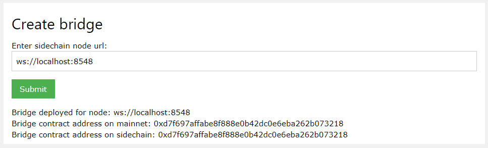
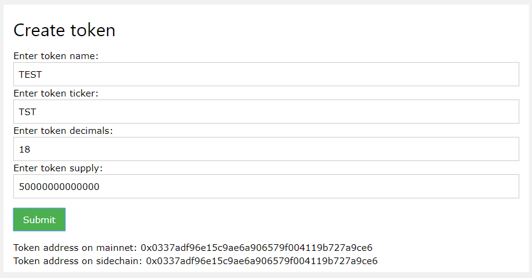
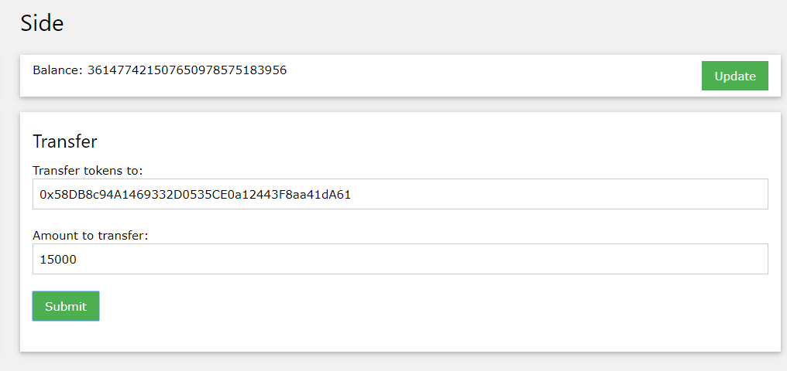
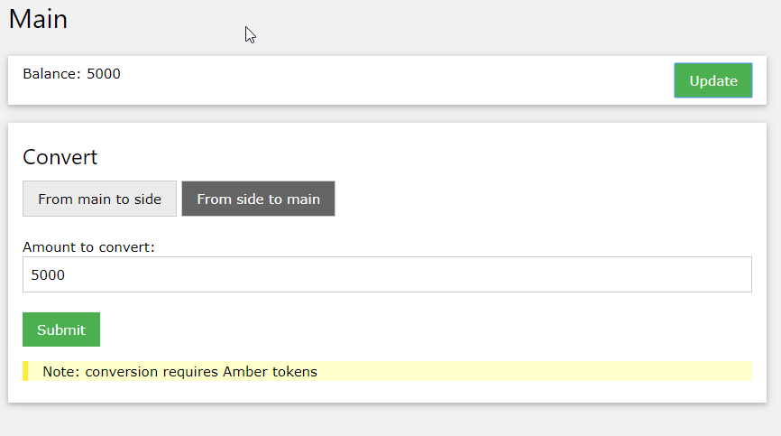

# Bridged token PoC

## Overview

This repository contains a PoC implementation of a bridged ERC20 token. The token is created on a `main` network and can be converted to a native (e.g. ETH, AMB) token in a `sidechanel`. 

The detailed documenation about this PoC and it's architecture is provided in [Sidechannel+PoC+documentation.pdf](Sidechannel+PoC+documentation.pdf).

## Running the PoC

1. Install dependencies using `npm install`
2. Start two blockchain networks (`main` and `side`) using `npm run network`
3. Now, start the Dashboard using `npm run dashboard`. By default the dashboard starts at [localhost:8080](http://localhost:8080)

The Dashboard is a basic web application that allows you to create connections between networks and to deploy ERC20 tokens. Potentially sidechannel deployment can be handled by smart contracts in AMB-NET (see "Appendix A" in [Sidechannel+PoC+documentation.pdf](Sidechannel+PoC+documentation.pdf)). The PoC simply uses the two launched networks.

4. From the dashboard you can create the bridge, which will connect the two networks. 

In the `Create bridge` section of the dashboard enter the URL of a sidechain node (`ws://localhost:8548` by default) and click "Submit"

5. Once the bridge is deployed, addresses of the bridge smart contracts will be shown.
6. Open [Oracle/Oracle.conf](Oracle/Oracle.conf) and enter the bridge smart contract addresses into the configuration file (the `bridge` section). 

Note that addresses of the two smart contracts may end up the same since the contracts are on different networks.

7. Now, open a new terminal and launch the oracle using `npm run oracle`.
At this point the two networks are connected by a bridge through the oracle.
8. Using the dashboard, You can create a bridged ERC20 token to test out the connection.

In the `Create token` section of the dashboard enter the details of your token and click "Submit".

9. Once the token is deployed, addresses of token smart contracts will be shown.
10. Open [Wallet/Wallet.conf](Wallet/Wallet.conf) and enter the bridge smart contract addresses into the configuration file (the `token` section). This step is similar to step 6.

11. Now, open a new (third) terminal and launch the wallet web app using `npm run wallet`.
Note: it is necessary to open many terminals if you want to see log output from each process. Realistically, these components are meant to be deployed on separate servers. If you don't want to see log output, you can launch processes in the background e.g. `npm run wallet &`

From the wallet you can transfer tokens between accounts in your sidechain and convert these tokens into tokens from the mainnet and back. (see [Sidechannel+PoC+documentation.pdf](Sidechannel+PoC+documentation.pdf) for detailed usage scenarios)

